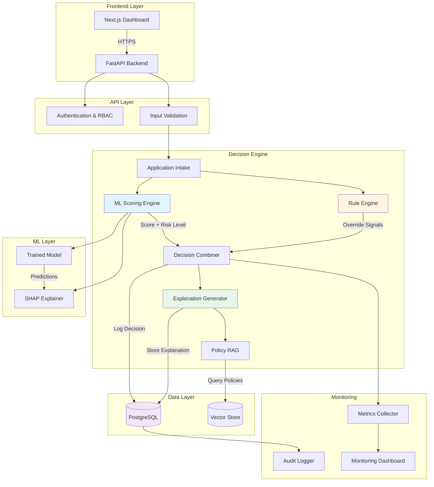
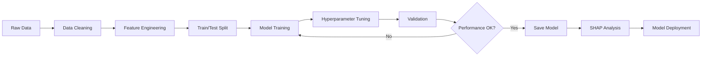
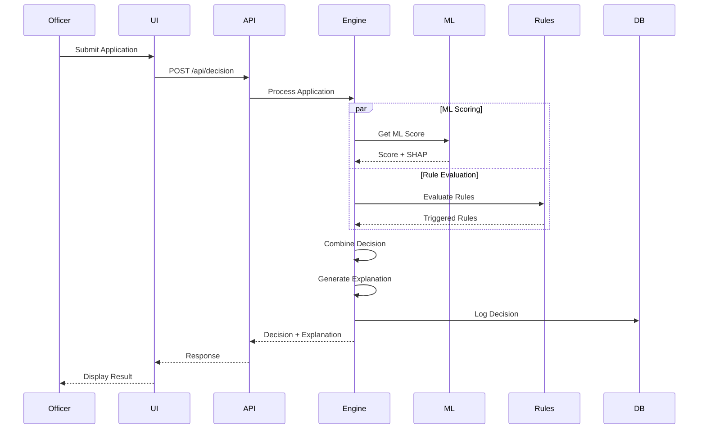
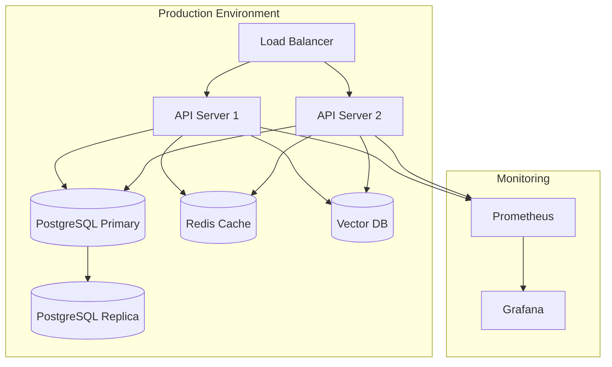

# System Architecture

## Overview

The AI Credit Decision Explanation Platform follows a **hybrid ML + rule-based architecture** with comprehensive audit logging and explainability at every layer.

## Architecture Diagram



## Component Details

### 1. Frontend Layer (Next.js)

**Technology**: Next.js 14 + TypeScript + TailwindCSS + shadcn/ui

**Responsibilities**:
- Officer dashboard for application review
- Case detail view with explanations
- What-if simulation interface
- Manual override workflow
- Search and filtering
- Role-based UI rendering

**Key Pages**:
```
/                          → Dashboard (application list)
/cases/[id]                → Case detail with explanation
/cases/[id]/simulate       → What-if simulation
/audit                     → Audit log viewer (admin only)
/settings                  → Configuration (admin only)
```

**Design Principles**:
- Premium, modern aesthetics (gradients, glassmorphism, animations)
- Responsive design (desktop-first for officers)
- Accessibility (WCAG 2.1 AA)
- Dark mode support

---

### 2. API Layer (FastAPI)

**Technology**: Python 3.11+ + FastAPI + Pydantic

**Endpoints**:

```python
# Application Management
POST   /api/applications          # Submit new application
GET    /api/applications          # List applications (paginated)
GET    /api/applications/{id}     # Get application details
PUT    /api/applications/{id}     # Update application

# Decision Processing
POST   /api/decision              # Get credit decision
POST   /api/decision/simulate     # What-if simulation

# Case Management
GET    /api/cases                 # List decided cases
GET    /api/cases/{id}            # Get case with explanation
POST   /api/cases/{id}/override   # Manual override

# Audit & Compliance
GET    /api/audit-log             # Retrieve audit logs
GET    /api/audit-log/{id}        # Get specific log entry

# Policy & Rules
GET    /api/policies              # List policies
GET    /api/policies/search       # RAG search policies
GET    /api/rules                 # List active rules

# Monitoring
GET    /api/health                # Health check
GET    /api/metrics               # System metrics
```

**Middleware**:
- Authentication (JWT)
- Authorization (RBAC)
- Request validation (Pydantic)
- Rate limiting
- CORS handling
- Audit logging

---

### 3. Decision Engine

#### 3.1 Application Intake

**Responsibilities**:
- Validate input data
- Check for missing/invalid values
- Detect outliers
- Normalize features
- Version input data

**Validation Rules**:
```python
{
    "monthly_income": {"min": 0, "max": 1000000},
    "debt_to_income": {"min": 0, "max": 2.0},
    "age": {"min": 20, "max": 70},
    # ... etc
}
```

#### 3.2 ML Scoring Engine

**Model**: Logistic Regression (primary) + XGBoost (optional)

**Process**:
1. Load trained model from disk
2. Preprocess input features
3. Generate prediction score (0-1)
4. Classify into risk bands:
   - Low: score < 0.3
   - Medium: 0.3 ≤ score < 0.7
   - High: score ≥ 0.7
5. Calculate SHAP values for explanation

**Output**:
```json
{
  "ml_score": 0.45,
  "risk_level": "medium",
  "confidence": 0.82,
  "feature_importance": {
    "debt_to_income": 0.35,
    "late_payment_count": 0.28,
    "monthly_income": 0.22,
    "credit_utilization": 0.15
  }
}
```

#### 3.3 Rule Engine

**Rule Evaluation**:
```python
# Pseudo-code
for rule in active_rules:
    if evaluate_condition(rule.condition, application_data):
        triggered_rules.append(rule)
        if rule.action == "reject" and not rule.override_allowed:
            return immediate_rejection(rule)
```

**Rule Priority**:
1. **Critical** (auto-reject, no override): DTI > 0.65, previous defaults
2. **High** (reject, officer can override): Late payments ≥ 3
3. **Medium** (flag for review): High utilization, short history
4. **Low** (informational): Minor risk factors

**Output**:
```json
{
  "triggered_rules": ["R001", "R004"],
  "highest_severity": "critical",
  "override_allowed": false,
  "rule_decision": "reject"
}
```

#### 3.4 Decision Combiner

**Logic**:
```python
def combine_decision(ml_output, rule_output):
    # Rules override ML
    if rule_output.action == "reject" and not rule_output.override_allowed:
        return "rejected", rule_output.reason
    
    # ML suggests approval, no critical rules
    if ml_output.risk_level == "low" and rule_output.highest_severity != "critical":
        return "approved", "Low risk profile"
    
    # Medium risk or conflicting signals
    if ml_output.risk_level == "medium" or rule_output.highest_severity == "medium":
        return "review", "Manual review required"
    
    # High risk
    return "rejected", "High risk profile"
```

**Final Decision**:
```json
{
  "decision": "rejected",
  "confidence": 0.95,
  "primary_reason": "High DTI ratio",
  "contributing_factors": ["Late payments", "High credit utilization"]
}
```

#### 3.5 Explanation Generator

**Process**:
1. Combine triggered rules
2. Extract top feature importance from SHAP
3. Map to human-readable text
4. Add policy citations
5. Generate recommendations
6. Format in Thai and English

**Template System**:
```python
templates = {
    "high_dti": {
        "th": "อัตราส่วนหนี้สินต่อรายได้ของคุณอยู่ที่ {dti:.1%} ซึ่งสูงกว่าเกณฑ์ที่กำหนด ({threshold:.1%})",
        "en": "Your debt-to-income ratio is {dti:.1%}, which exceeds our threshold of {threshold:.1%}"
    }
}
```

**Output**:
```json
{
  "explanation": {
    "th": {
      "summary": "คำขอสินเชื่อถูกปฏิเสธเนื่องจากอัตราส่วนหนี้สินต่อรายได้สูงเกินไป",
      "details": [
        "อัตราส่วนหนี้สินต่อรายได้: 72% (เกณฑ์: 65%)",
        "ประวัติการชำระหนี้ล่าช้า: 3 ครั้งใน 24 เดือน"
      ],
      "recommendations": [
        "ลดภาระหนี้สินให้ต่ำกว่า 65% ของรายได้",
        "สร้างประวัติการชำระหนี้ที่ดีอย่างน้อย 12 เดือน"
      ]
    },
    "en": { /* English version */ }
  },
  "policy_citations": [
    "Credit Policy Section 3.2.1: Maximum DTI Ratio",
    "Credit Policy Section 4.1.3: Late Payment Criteria"
  ],
  "feature_contributions": {
    "debt_to_income": -0.35,
    "late_payment_count": -0.28,
    "monthly_income": 0.15
  }
}
```

---

### 4. ML Layer

#### Model Training Pipeline



**Training Process**:
1. Load synthetic credit data
2. Clean and validate
3. Engineer features (ratios, aggregations)
4. Split 80/20 train/test
5. Train Logistic Regression
6. Evaluate on test set (AUC, precision, recall)
7. Generate SHAP explainer
8. Save model + metadata

**Model Versioning**:
- Semantic versioning (v1.0.0, v1.1.0, etc.)
- Store in `models/credit_model_v{version}.pkl`
- Metadata in `models/model_metadata_v{version}.json`
- Track which version used for each decision

---

### 5. Data Layer

#### PostgreSQL Schema

**Tables**:

```sql
-- Applications
CREATE TABLE applications (
    application_id UUID PRIMARY KEY,
    created_at TIMESTAMP NOT NULL,
    updated_at TIMESTAMP,
    customer_data JSONB NOT NULL,
    status VARCHAR(20) NOT NULL
);

-- Decisions
CREATE TABLE decisions (
    decision_id UUID PRIMARY KEY,
    application_id UUID REFERENCES applications(application_id),
    timestamp TIMESTAMP NOT NULL,
    model_version VARCHAR(20) NOT NULL,
    rule_version VARCHAR(20) NOT NULL,
    ml_score FLOAT NOT NULL,
    ml_risk_level VARCHAR(10) NOT NULL,
    triggered_rules JSONB NOT NULL,
    final_decision VARCHAR(20) NOT NULL,
    explanation JSONB NOT NULL,
    officer_id UUID,
    override_applied BOOLEAN DEFAULT FALSE,
    override_reason TEXT
);

-- Audit Logs
CREATE TABLE audit_logs (
    log_id UUID PRIMARY KEY,
    application_id UUID REFERENCES applications(application_id),
    timestamp TIMESTAMP NOT NULL,
    event_type VARCHAR(50) NOT NULL,
    event_data JSONB NOT NULL,
    user_id UUID,
    ip_address INET,
    user_agent TEXT
);

-- Rules
CREATE TABLE rules (
    rule_id VARCHAR(10) PRIMARY KEY,
    rule_name VARCHAR(100) NOT NULL,
    condition TEXT NOT NULL,
    severity VARCHAR(20) NOT NULL,
    action VARCHAR(20) NOT NULL,
    reason_th TEXT NOT NULL,
    reason_en TEXT NOT NULL,
    active BOOLEAN DEFAULT TRUE,
    version VARCHAR(20) NOT NULL
);

-- Users (for RBAC)
CREATE TABLE users (
    user_id UUID PRIMARY KEY,
    username VARCHAR(50) UNIQUE NOT NULL,
    email VARCHAR(100) UNIQUE NOT NULL,
    role VARCHAR(20) NOT NULL,
    created_at TIMESTAMP NOT NULL
);
```

**Indexes**:
```sql
CREATE INDEX idx_applications_created ON applications(created_at);
CREATE INDEX idx_decisions_timestamp ON decisions(timestamp);
CREATE INDEX idx_decisions_application ON decisions(application_id);
CREATE INDEX idx_audit_logs_timestamp ON audit_logs(timestamp);
CREATE INDEX idx_audit_logs_application ON audit_logs(application_id);
```

#### Vector Store (for RAG)

**Technology**: ChromaDB or FAISS

**Purpose**: Semantic search over policy documents

**Process**:
1. Chunk policy documents (500-1000 tokens)
2. Generate embeddings (sentence-transformers)
3. Store in vector database
4. Query with decision context
5. Retrieve relevant policy sections
6. Cite in explanation

---

### 6. Advanced Features

#### 6.1 What-if Simulation

**Process**:
1. Load original application
2. Allow officer to modify parameters
3. Re-run decision engine
4. Compare original vs. simulated
5. Show delta in decision/explanation

**Use Cases**:
- "What if income was 10% higher?"
- "What if we reduce loan amount by 20%?"
- "What if late payments were 0?"

#### 6.2 Manual Override

**Workflow**:
1. Officer reviews rejected case
2. Clicks "Override Decision"
3. Must select override reason
4. Must provide written justification
5. System logs override in audit trail
6. Requires manager approval (for critical rules)

**Audit Trail**:
```json
{
  "override_id": "uuid",
  "original_decision": "rejected",
  "new_decision": "approved",
  "officer_id": "uuid",
  "reason_code": "exceptional_circumstances",
  "justification": "Customer has secured new employment...",
  "manager_approval": "uuid",
  "timestamp": "2026-01-19T12:00:00Z"
}
```

#### 6.3 Policy RAG

**Query Process**:
```python
# 1. Extract decision context
context = f"DTI: {dti}, Late payments: {late}, Income: {income}"

# 2. Generate query embedding
query_embedding = embed_model.encode(context)

# 3. Search vector store
results = vector_store.query(query_embedding, top_k=3)

# 4. Extract policy citations
citations = [r.metadata['section'] for r in results]

# 5. Add to explanation
explanation['policy_citations'] = citations
```

---

## Data Flow

### Typical Decision Flow



---

## Security Architecture

### Authentication & Authorization

**Authentication**: JWT tokens
```json
{
  "user_id": "uuid",
  "username": "officer1",
  "role": "credit_officer",
  "exp": 1234567890
}
```

**Roles**:
- **Admin**: Full system access, configuration, user management
- **Credit Officer**: Review applications, override decisions
- **Auditor**: Read-only access to audit logs
- **Viewer**: Dashboard view only

**Permissions Matrix**:

| Action | Admin | Officer | Auditor | Viewer |
|--------|-------|---------|---------|--------|
| Submit Application | ✅ | ✅ | ❌ | ❌ |
| View Cases | ✅ | ✅ | ✅ | ✅ |
| Override Decision | ✅ | ✅ | ❌ | ❌ |
| View Audit Logs | ✅ | ✅ | ✅ | ❌ |
| Modify Rules | ✅ | ❌ | ❌ | ❌ |
| User Management | ✅ | ❌ | ❌ | ❌ |

### Data Privacy

**PII Masking**:
```python
def mask_pii(data, role):
    if role == "auditor":
        data['name'] = mask_name(data['name'])
        data['id_number'] = "***-***-" + data['id_number'][-4:]
    return data
```

**Encryption**:
- At rest: PostgreSQL transparent data encryption
- In transit: TLS 1.3
- Sensitive fields: Application-level encryption

---

## Monitoring & Observability

### Metrics

**System Metrics**:
- Request latency (p50, p95, p99)
- Throughput (requests/second)
- Error rate
- Database query time

**Business Metrics**:
- Approval rate
- Rejection rate
- Override rate
- Average decision time

**ML Metrics**:
- Score distribution
- Prediction confidence
- Feature importance drift
- Model performance degradation

### Alerting

**Alerts**:
- High error rate (> 5%)
- Slow response time (p95 > 1s)
- Approval rate anomaly (> 20% change)
- Model drift detected

---

## Deployment Architecture



**Infrastructure**:
- **API**: 2+ instances (auto-scaling)
- **Database**: PostgreSQL with read replica
- **Cache**: Redis for session/model caching
- **Vector DB**: ChromaDB for policy RAG
- **Monitoring**: Prometheus + Grafana

---

**Document Version**: 1.0  
**Last Updated**: 2026-01-19  
**Status**: Ready for Implementation
